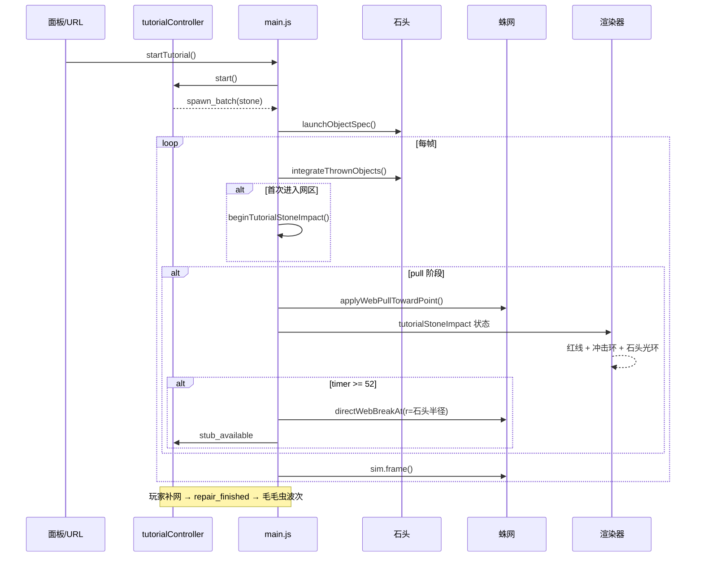

# 教学关石头破网 — 制作流程

本文档记录「教学关石头砸网 → 拉扯动态 → 真实破洞 → 补网 → 收虫」功能的完整制作流程，供后续迭代或复用到其他关卡脚本时参考。

---

## 一、目标定义

### 玩家应看到什么

1. 一颗**大尺寸石头**从屏幕上方落下（视觉-only，不参与粘网物理）
2. 石头进入蛛网区域后，**网线向石头中心被拉扯**，接触线段变红闪烁
3. 拉扯约 0.9 秒后，在**石头半径大小的圆形范围**内真实删除网线，留下一个洞
4. 石头**穿过破洞**继续下落，不产生物理粘连
5. 断线头（stub）出现，玩家拖拽补网，之后进入毛毛虫教学波次

### 设计约束

| 约束 | 说明 |
|------|------|
| 破坏范围 = 石头半径 | 使用 `TUTORIAL_STONE_RADIUS`（90px），与视觉石头等大 |
| 单洞破坏 | 只破一次，不做贯穿撕裂 |
| 脚本触发 | 不依赖石头与网线的物理碰撞；用几何判定 + 脚本删线 |
| 真实拓扑 | 破网后走现有 `breakWebInRadius` / stub / repair 管线 |
| 与波次解耦 | 教学状态机独立于 `levelSystem` 波次生成器 |

---

## 二、模块划分

```
┌─────────────────────────────────────────────────────────────┐
│  UI 入口                                                     │
│  index.html + panel.js → Play Tutorial / ?tutorial=1       │
└──────────────────────────┬──────────────────────────────────┘
                           ▼
┌─────────────────────────────────────────────────────────────┐
│  教学状态机  tutorialController.js                          │
│  intro → spawn stone → wait repair → wave1/2 → handoff      │
└──────────────────────────┬──────────────────────────────────┘
                           ▼
┌─────────────────────────────────────────────────────────────┐
│  主循环桥接  main.js                                         │
│  startTutorial / processTutorialActions / 石头冲击状态       │
└──────┬───────────────────┬───────────────────┬──────────────┘
       ▼                   ▼                   ▼
┌──────────────┐  ┌─────────────────┐  ┌──────────────────────┐
│ ThrownObj    │  │ webRenderer     │  │ objectRenderer       │
│ stone 类型   │  │ 危险区红线+冲击环│  │ 石头张力光环         │
│ breakWeb...  │  │                 │  │                      │
└──────────────┘  └─────────────────┘  └──────────────────────┘
```

---

## 三、制作步骤（推荐顺序）

### Step 1 — 教学状态机骨架

**文件：** `src/tutorial/tutorialController.js`

1. 定义阶段常量：`INTRO_WAIT → BREAKERS → WAIT_REPAIR_* → WAVE_* → DONE`
2. 实现 `createTutorialController(W, H, cx, cy)`，通过 `drainActions()` 向主循环输出指令
3. 动作类型：
   - `show_message` — 顶部提示文案
   - `spawn_batch` — 生成石头 / 毛毛虫
   - `clear_breakers` — 补网完成后移除石头
   - `set_insect_target` — 覆盖关卡目标 HUD
   - `mark_completed` / `handoff_to_level_1`

**验收：** `npm test` 中 `tutorial flow reaches handoff` 通过。

---

### Step 2 — 石头实体（视觉 + 穿透）

**文件：** `src/entities/ThrownObj.js`、`src/render/objectRenderer.js`

1. 新增 `kind: 'stone'` 定义：`r: 80`（可被 `defOverrides` 覆盖为 90）
2. 设置 `_disableRestick = true`，跳过粘网逻辑
3. 在 `objectRenderer` 绘制灰色大圆盘（径向渐变 + 高光）

**验收：** 手动 `launchObjectSpec({ kind:'stone', ... })` 可见大圆盘下落。

---

### Step 3 — 真实破网 API

**文件：** `src/entities/ThrownObj.js`

1. 导出 `breakWebInRadius(x, y, r, spiderweb, ...)`
2. 石头模式使用 `segmentHitsCircle`（线段-圆相交），破坏面与半径一致
3. 导出 `segmentHitsCircle` 供渲染层复用

**验收：** `test/stoneWebBreak.test.js` — 仅圆内线段被删除。

---

### Step 4 — 触发判定（可靠进入网区）

**文件：** `src/tutorial/tutorialController.js`

石头下落快，单帧可能跳过重叠检测。采用**双条件 OR**：

```text
触发 = 圆盘首次进入（stoneOverlapsWebAt）
    OR 石头底沿穿过网带上缘（stoneCrossesWebTopBand + 水平居中）
```

| 函数 | 作用 |
|------|------|
| `stoneOverlapsWebAt` | 石头圆与蛛网外接圆相交 |
| `stoneCrossesWebTopBand` | `prevY+r < webTop` 且 `nextY+r >= webTop` |
| `shouldTriggerTutorialStoneImpact` | 组合上述条件 |

**验收：** `test/tutorialController.test.js` 中触发相关用例全绿。

---

### Step 5 — 拉扯动态（核心观感）

**文件：** `src/tutorial/tutorialController.js`、`src/main.js`

#### 5.1 状态对象 `tutorialStoneImpact`

```js
{ x, y, r, phase: 'pull'|'done', timer, stoneObj }
```

#### 5.2 每帧流程（main.js 主循环）

```text
integrateThrownObjects()
  └─ tryBeginTutorialStoneImpact()   // 首帧触发，创建 impact

updateTutorialStoneImpactFollow(dt)   // pull 阶段每帧
  ├─ 同步石头位置到 impact.x/y
  ├─ applyWebPullTowardPoint()        // 拉扯网粒子向石头
  ├─ 石头减速 spawnVy *= 0.98
  ├─ tickTutorialStoneImpact()        // timer += dt
  └─ shouldBreak → directWebBreakAt() // 真实删线 + stub

sim.frame()                           // Verlet 继续积分
```

#### 5.3 拉扯物理参数

| 参数 | 值 | 说明 |
|------|-----|------|
| `TUTORIAL_STONE_PULL_FRAMES` | 52 | 约 0.87s @60fps |
| 拉扯半径 | `r * 1.18` | 略大于破坏圆，让边缘线也有张力 |
| 强度曲线 | `0.06 + 0.34 * progress` | 随时间加剧 |
| lastPos 回拉 | `pull * 0.42` | 制造线段拉伸感 |

**验收：** 肉眼可见网线凹陷、石头周围红圈、石头略减速。

---

### Step 6 — 渲染层危险区

**文件：** `src/render/webRenderer.js`、`src/render/objectRenderer.js`

1. `setupWebDraw` 增加第 9 参数 `getTutorialStoneImpact`
2. `_needsDangerPass`：pull 阶段强制走危险着色通道
3. `_applyTutorialStoneImpactDanger`：对 `segmentHitsCircle` 命中的约束设 `_dangerRaw`
4. `_drawTutorialStoneImpactRing`：石头位置画红色脉冲圆环
5. 石头本体：`_tutorialPullTension` 驱动外圈光环

**验收：** 拉扯时接触线段红白闪烁，与毛毛虫粘网危险效果风格一致。

---

### Step 7 — 主循环桥接

**文件：** `src/main.js`

| 职责 | 函数 |
|------|------|
| 启动教学 | `startTutorial()` |
| 消费动作 | `processTutorialActions()` |
| 破网执行 | `directWebBreakAt()` → `breakWebInRadius` |
| stub 通知 | `notifyTutorialStubIfNeeded()` → `stub_available` 事件 |
| 补网完成 | `repair_drag_completed` / `repair_finished` 事件 |
| HUD 覆盖 | `getLevelCfgAt` 在教学模式下返回 `tutorialTargets` |

**入口：**

- Level Conditions 面板 → `Play Tutorial`
- URL `?tutorial=1` 自动启动

---

### Step 8 — 测试清单

```bash
npm test        # 14 项单元测试
npm run build   # 单文件打包
```

| 测试文件 | 覆盖点 |
|----------|--------|
| `test/tutorialController.test.js` | 状态机、触发、拉扯 tick、粒子拉扯 |
| `test/stoneWebBreak.test.js` | 破坏半径与线段相交 |

**手动回归：**

1. Play Tutorial → 等 3 秒 → 石头落下
2. 观察拉扯 + 变红 + 破洞
3. 拖拽 stub 补网 → 毛毛虫波次
4. 收齐 2 只虫 → 跳转 Level 1

---

## 四、时序图



---

## 五、关键常量速查

| 常量 | 值 | 位置 |
|------|-----|------|
| `TUTORIAL_STONE_RADIUS` | 90 | `tutorialController.js` |
| `TUTORIAL_STONE_PULL_FRAMES` | 52 | `tutorialController.js` |
| 石头初速 `vy` | 6.2 | `buildBreakersBatch()` |
| 石头 `_disableRestick` | true | `ThrownObj` / `launchObjectSpec` |
| intro 等待 | 3s (180帧) | `INTRO_DELAY_FRAMES` |

---

## 六、常见问题排查

| 现象 | 可能原因 | 检查点 |
|------|----------|--------|
| 完全没有破网 | 触发未命中 | `shouldTriggerTutorialStoneImpact` 的 `webCx/webCy/webRad` 是否与 `buildWeb()` 一致 |
| 破网但无拉扯 | `tutorialStoneImpact` 未创建 | `tutorialActive`、`_tutorialTag === 'breaker'` |
| 拉扯但不破洞 | `breakWebInRadius` 返回 0 | 石头位置是否落在有网线的区域；`useSegmentHit: true` 是否传入 |
| 破洞太大/贯穿 | 多次触发 | 确认 `_holePunched` 与 `tutorialStoneImpact` 互斥 |
| 无 stub | 破线数为 0 | SpatialIndex 是否 sync；`notifyTutorialStubIfNeeded` 是否调用 |
| 红线不显示 | 渲染未走 danger 通道 | `getTutorialStoneImpact` 是否传入 `setupWebDraw` |

---

## 七、扩展建议

若要将同样效果用于正式关卡（非教学脚本）：

1. 把 `tutorialStoneImpact` 泛化为 `scriptedWebImpact`（去掉 `tutorialActive` 门控）
2. 在关卡配置中加 `breaker: { kind, r, pullFrames, breakOnEnter }` 字段
3. 拉扯强度可按 `weight` 或 `impactEnergy` 缩放
4. 可考虑在拉扯阶段播放低频「绷线」音效（`audioEngine`）

---

## 八、相关文件索引

```
src/tutorial/tutorialController.js   # 状态机 + 触发 + 拉扯纯函数
src/main.js                          # 桥接、主循环、破网调用
src/entities/ThrownObj.js            # stone 类型、breakWebInRadius
src/render/webRenderer.js            # 危险区渲染、冲击环
src/render/objectRenderer.js         # 石头绘制、张力光环
src/ui/panel.js                      # Play Tutorial 按钮
index.html                           # tutorial-hint 浮层
test/tutorialController.test.js      # 流程 + 触发 + 拉扯测试
test/stoneWebBreak.test.js           # 破坏半径测试
```